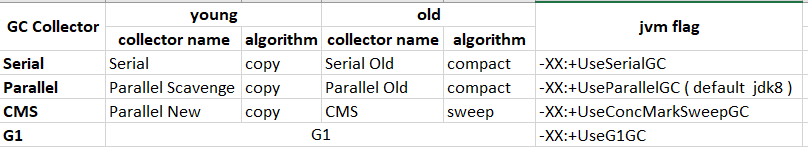
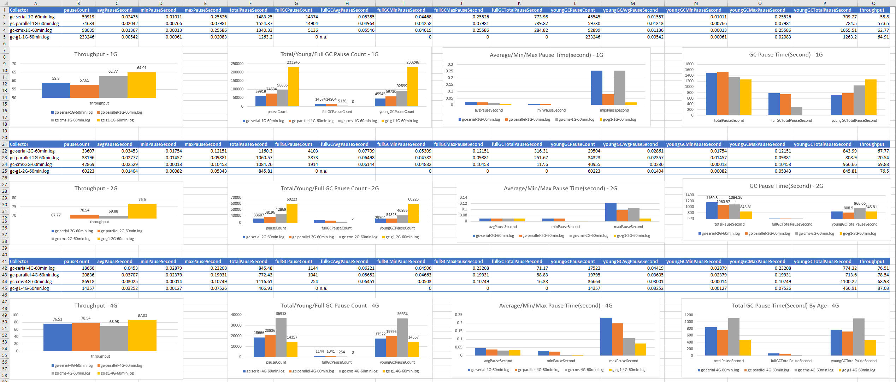

# （必做） 根据上述自己对于 1 和 2 的演示，写一段对于不同 GC 的总结，提交到 Github。

* 说明：
  * 以下实验针对不同垃圾收集器：serial，parallel，cms和G1，分别在堆大小为1G, 2G, 4G配置下运行六十分钟，分析系统吞吐量，GC停顿次数和时间
  * 运行环境：windows 10, cpu 8核心， 内存：24G
  * GC分析工具为GCViewer

# 结果

收集器名字：

## 结论

## 吞吐量
    * 总体上：G1 > Parallel > CMS > Serial
    * 在小内存时（1G)，Serial > parallel, 随着内存增大Parallel多线程优势变大

## GC停顿
    * 在当内存小于4G时，GC停顿总次数： G1 >> CMS > Parallel > Serial，猜想：G1需要占用比较多的额外内存用于记录Region统计信息，内存利用率不高，导致频繁GC， 但是当在大内存情况下G1优于其他三种
    * CMS Full GC 次数总体上远小于 Parallel和Serial
    * 在平均/最小/最大停顿时间上G1 < CMS < Parallel < Serial， 在大内存时比较明显
    * FullGC总停顿时间：CMS << Parallel < Serial
    * Young GC, 在小内存（1G)，停顿时间： Serial < Parallel < CMS < G1, CMS 在young区GC停顿时间总体上最高，甚至超过Serial